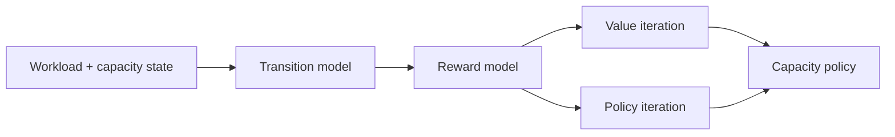

# Mdp Resource Optimizer

[](https://www.python.org/) [](#testing) [](LICENSE)

> Optimize dynamic compute capacity with Markov Decision Processes, value iteration, and policy iteration.

## Why this project exists

A cloud service must decide when to scale compute capacity up, down, or maintain capacity while balancing operating cost and overload risk.

The implementation is intentionally small and reproducible so the underlying AI reasoning is easy to inspect, benchmark, and discuss.

## AI concepts demonstrated

MDP state design, stochastic transitions, reward functions, Bellman optimality, value iteration, policy iteration

## Architecture



## Results

The supplied demo produces the same optimal policy with both solvers on the configured 4x4 state space.

| Solver | Policy agreement |
|---|---|
| Value Iteration | Baseline |
| Policy Iteration | Matches value-iteration policy |

## Project structure

```text
mdp-resource-optimizer/
├── README.md
├── LICENSE
├── requirements.txt
├── examples/
│   └── demo.py
├── src/
│   └── implementation
└── tests/
    └── test_*.py
```

## Run locally

```bash
python -m venv .venv
# macOS/Linux
source .venv/bin/activate
# Windows PowerShell
# .venv\Scripts\Activate.ps1

pip install -r requirements.txt
PYTHONPATH=. python examples/demo.py
```

## Testing

```bash
PYTHONPATH=. pytest -q
```

## Ideas for extending the project

- Scale the environment or dataset and compare runtime and search behavior.
- Add richer visualizations or an interactive interface.
- Introduce additional baselines and ablation experiments.
- Add configuration files so experiments are reproducible from the command line.

## Portfolio note

This project is independently structured and documented as a portfolio implementation inspired by AI concepts studied in CS221. Do not publish course-provided starter code, solutions, tests, or restricted materials.

## GitHub metadata

**Repository name**

`mdp-resource-optimizer`

**Description**

`Optimize dynamic compute capacity with Markov Decision Processes, value iteration, and policy iteration.`

**Topics**

`artificial-intelligence` `mdp` `markov-decision-processes` `value-iteration` `policy-iteration` `reinforcement-learning` `python` `cs221`
